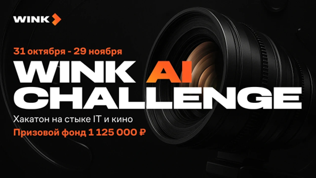

# Wink AI Challenge

Хакатон на стыке IT и кино от онлайн-кинотеатра **Wink** и платформы **Codenrock**.  
Цель соревнования — создать прикладные AI-решения, которые ускоряют и упрощают производство фильмов и сериалов.

- **Формат:** онлайн + очный финал в Москве  
- **Даты проведения:** 31.10.2025 16:00 – 19.11.2025 18:00  
- **Размер команды:** от 1 до 4 участников  
- **Призовой фонд:** **1 125 000 ₽**

## Тематики хакатона

Хакатон включает несколько направлений на пересечении:

- NLP
- MLOps
- Data Engineering
- Backend
- Frontend
- DevOps

## Треки (задачи)

### 1. Платформа автоматического разбора и структурирования сценариев

**Задача:**  
Разработать сервис, который автоматически парсит русскоязычный сценарий и генерирует структурированную таблицу сцен с указанием:

- локаций;
- времени суток;
- персонажей;
- массовки;
- реквизита;
- спецэффектов.

**Проблема, которую решаем:**  
Подготовка документации на основе текстового сценария — одна из самых трудоемких задач препродакшена. Ассистенты режиссёров и продюсеры вручную:

- разбивают сценарий на сцены,
- определяют локации и время суток,
- составляют списки персонажей, массовки, реквизита и спецэффектов.

Неоднозначные формулировки в тексте и ошибки в таблицах сцен приводят к сбоям в графике и дополнительным затратам на площадке, а отсутствие наглядной визуализации усложняет коммуникацию между отделами.

---

### 2. Интеллектуальный сервис превизуализации сценариев

**Задача:**  
Создать интеллектуальную систему превизуализации, которая преобразует текстовые сценарии в раскадровки:

- от чёрно-белых эскизов до детализированных ключевых кадров;
- с возможностью добавления анимационных переходов;
- с поддержкой разных художественных стилей.

Система должна распознавать и визуализировать:

- персонажей;
- локации;
- реквизит.

**Проблема, которую решаем:**  
Превизуализация сценариев требует значительных ресурсов и замедляет производство.  
Режиссёры и художники-постановщики по-прежнему полагаются на ручную раскадровку, а существующие цифровые сервисы решают лишь отдельные подзадачи. Это:

- ограничивает пространство для экспериментов;
- усложняет коллективную работу;
- может приводить к искажению исходного авторского замысла.

---

### 3. Автоматическая проверка возрастной категории по сценарию

**Задача:**  
Разработать сервис, который по русскоязычному сценарию автоматически определяет возрастной рейтинг фильма или сериала:

- 0+, 6+, 12+, 16+, 18+

Дополнительно сервис должен:

- указывать сцены или реплики, повышающие возрастную категорию;
- формировать удобный отчёт для пользователя.

**Проблема, которую решаем:**  
Для получения прокатного удостоверения фильму или сериалу обязательно присваивается возрастная категория. От неё зависит:

- где и когда можно показывать контент;
- какую аудиторию удастся охватить.

Возрастная категория зависит от наличия сцен:

- насилия,
- употребления алкоголя/наркотиков,
- нецензурной лексики,
- сексуального контента и т.п.

Продюсерам важно ещё до старта съёмок понимать предполагаемый рейтинг, так как он влияет на дистрибуцию и монетизацию. Автоматизированный анализ помогает:

- экономить время юристов и редакторов;
- точнее прогнозировать маркировку.

---

## О компании Wink

**Wink** — один из крупнейших российских видеосервисов, совместное предприятие «Ростелекома» и Национальной Медиа Группы. Сервис объединяет преимущества интерактивного ТВ и онлайн-кинотеатра.

В библиотеке Wink:

- более **300 телеканалов**;
- свыше **80 000** единиц контента: фильмы, сериалы, мультфильмы, концерты и другое, включая блогерский контент.

Wink.ru выпускает собственные оригинальные сериалы. В линейке **Wink Originals** — более 40 проектов, среди них:

- «Слово пацана. Кровь на асфальте»
- «Комбинация»
- «Фишер»
- «ГДР»
- «Балет»
- «Библиотекарь»
- «Плакса»
- «Чистые»
- «Любопытная Варвара»
- и другие.

---

## Таймлайн хакатона

- **24 октября** — митап с экспертами хакатона  
- **31 октября** — церемония открытия соревнования  
- **1–15 ноября** — три чекпоинта с возможностью обсудить решения с жюри  
- **20 ноября** — подведение итогов и объявление финалистов  
- **29 ноября** — очный финал в Москве: защита проектов и награждение победителей  

---

## Реферальная программа

На Wink AI Challenge действует реферальная программа:

1. Присоединитесь к соревнованию.  
2. Получите уникальную ссылку на странице мероприятия.  
3. Отправьте ссылку друзьям, знакомым и коллегам.  

Среди наиболее активных участников реферальной программы разыгрываются подарочные сертификаты на маркетплейсы. Важно: приглашённый участник должен зарегистрироваться, подтвердить участие и войти в команду, прошедшую модерацию.

---

## Контакты организаторов

- Telegram: **@vepolina**  
- Техническая поддержка: **support@codenrock.com**

---
